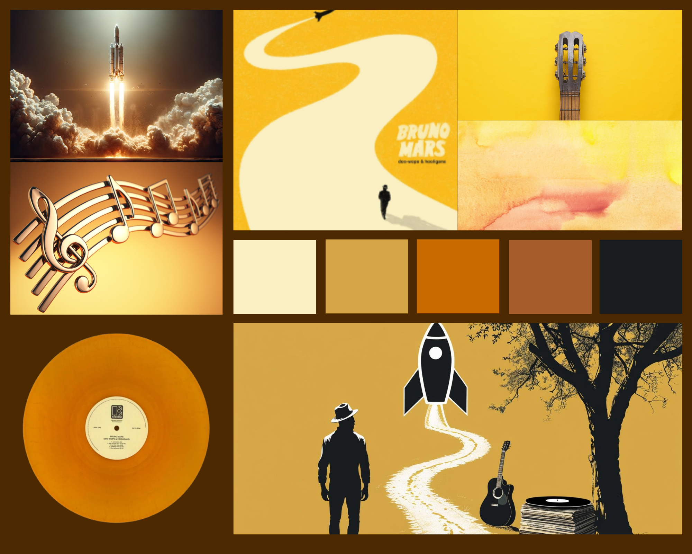

# Bruno Mars - Doo-Wops & Hooligans Creative Animation

**Auteur :** Mahalia PIRES

---

## 🎨 Concept

Ce projet est une animation interactive présentant un univers inspiré de la cover de l'album *Doo-Wops & Hooligans* de Bruno Mars.  
L'objectif est de proposer une expérience visuelle et sonore :  

- une ligne courbée animée se dessine à l'écran  
- un vinyle tourne lorsque l'on clique dessus, déclenchant la musique  
- Des éléments inspirés de l'univers de la couverture
- le tout en respectant la direction artistique de la pochette originale

---

## 🖼 Moodboard



---

## 🚀 Instructions pour lancer le projet

1. Cloner le projet :

```bash
git clone https://github.com/mahanunu/CreativeDesignBrunoMars.git
